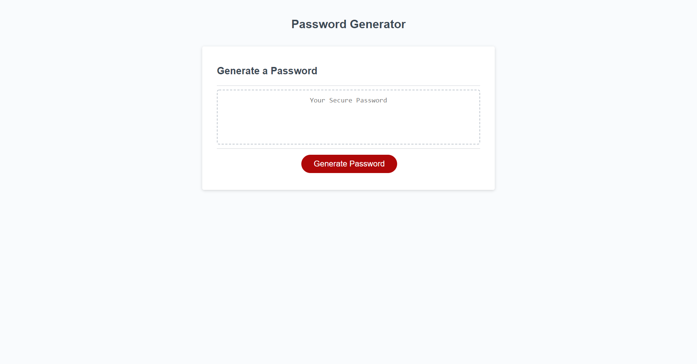

# Password Generator

## Description
Having secure and strong passwords is important when using the internet. A way of randomly generating passwords results in more secure passwords than if human-made.
## Installation
Copy the repository from GitHub: https://github.com/MHranek/Password_Generator and clone to your computer using Git Bash or Terminal, then open it in your favorite code editor.
Accessable on the web here: https://mhranek.github.io/Password_Generator/
## Usage
Click the 'Generate Password' button and follow the steps in the prompts. After successfully creating a password, select and copy the string for use elsewhere.

## Credits
https://www.geeksforgeeks.org/count-uppercase-lowercase-special-character-numeric-values/ This chunk of code allowed me to test the two different methods of creating the random password. It showed that the implemented way more consistently gives each set of characters representation.